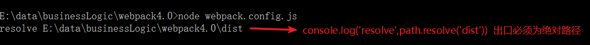
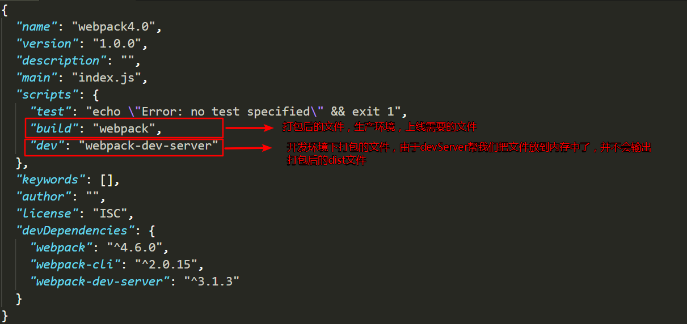
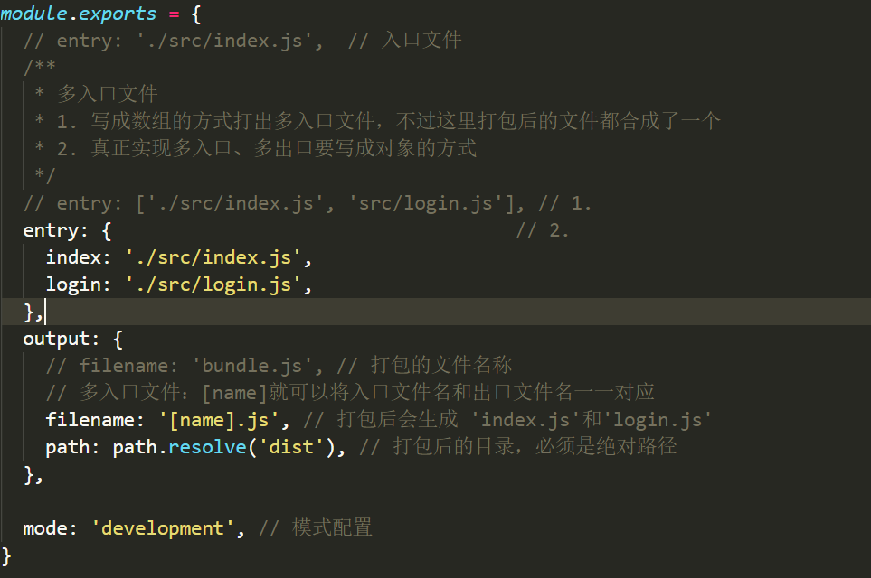
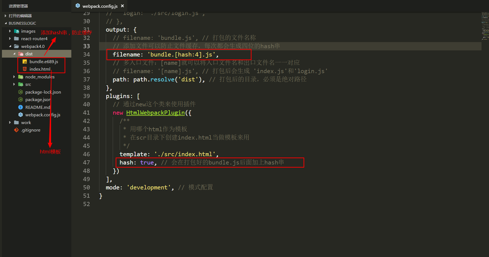
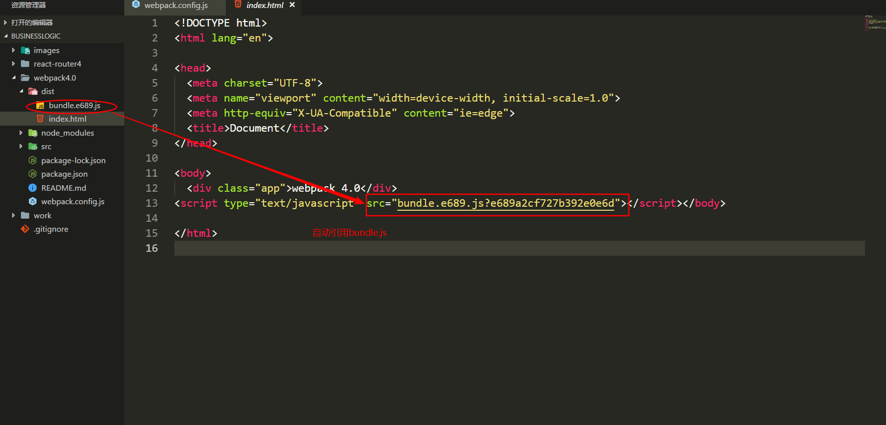
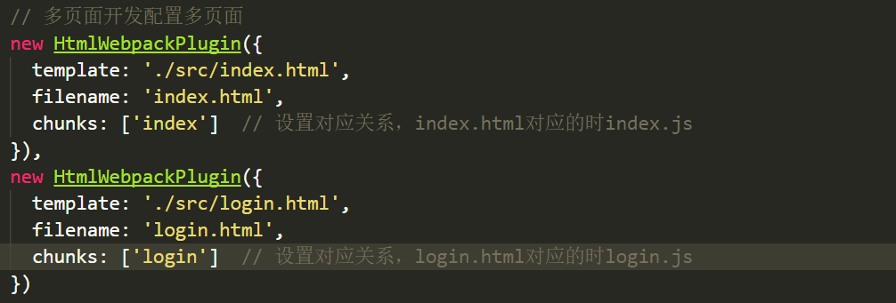

## webpack配置
```js
// webpack4中除了正常安装webpack之外还得单独安一个webpack-cli
npm i webpack webpack-cli -D
```
`npm install --save-dev`的简写，是指安装模块并保存到`package.json`的`devDependencies`中,主要在开发环境中的依赖包

`npm install -S`:`npm install --save`的简写，安装并保存到`package.json`的`dependencies`中，产品依赖包

### 配置入口和出口文件
`webpack.config.js`webpack的配置文件
```js
module.exports = {
  entry: '',  // 入口文件
  output: {}, // 出口文件
  module: {}, // 处理对应模块
  plugins: [], // 对应的插件
  devServer: {}, // 开发服务器配置
}
```

```js
module.exports = {
  entry: './src/index.js',  // 入口文件
  output: {
    filename: 'bundle.js', // 打包的文件名称
    path: path.resolve('dist'), // 打包后的目录，必须是绝对路径
  },
}
```
`path.resolve()`:把一个路径或一个路径片段的序列解析为一个绝对路径

`console.log(path.resolve('dist'))`


### 配置执行文件
在`package.json`中配置命令，如打包编译:`npm run build`


多入口文件配置



### 配置html模板
生成带`hash`串的`bundle.js`


`html`中自动引入打包后的js文件


多页面开发如何配置多页面

