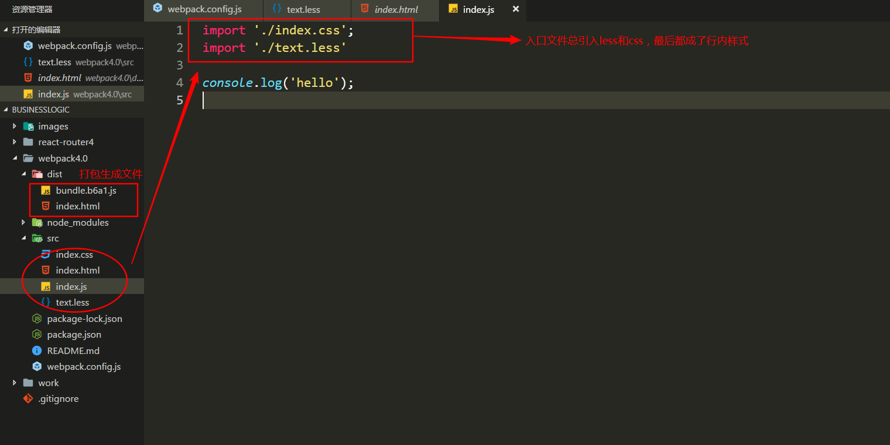
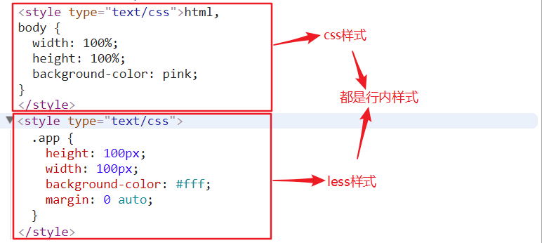
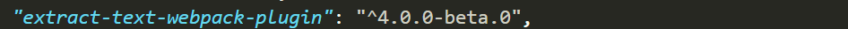
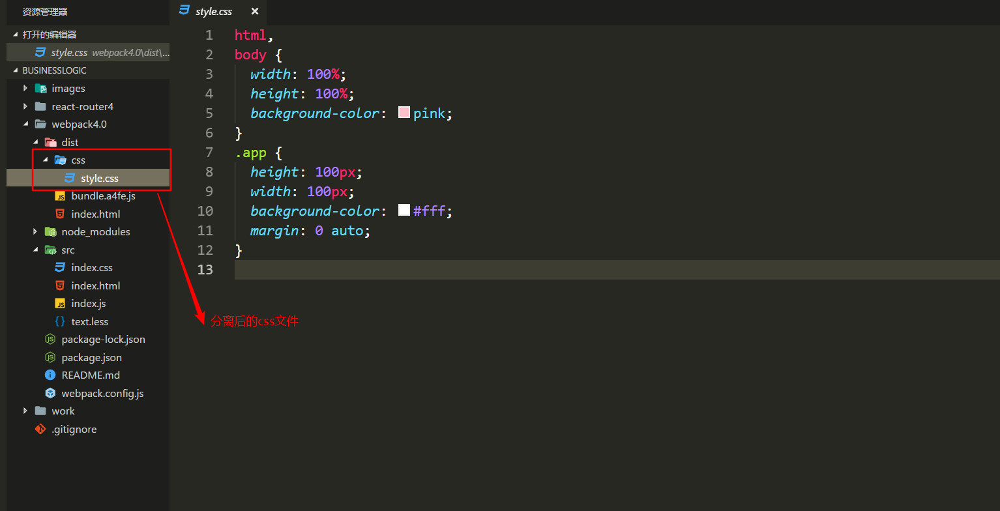
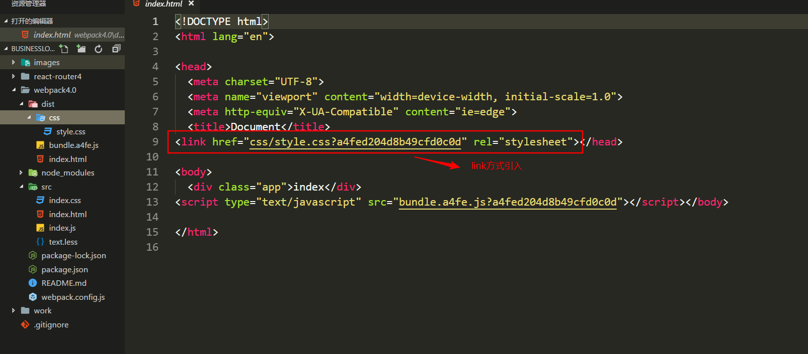

## webpack配置
```js
// webpack4中除了正常安装webpack之外还得单独安一个webpack-cli
npm i webpack webpack-cli -D
```
`npm install --save-dev`的简写，是指安装模块并保存到`package.json`的`devDependencies`中,主要在开发环境中的依赖包

`npm install -S`:`npm install --save`的简写，安装并保存到`package.json`的`dependencies`中，产品依赖包

### 配置入口和出口文件
`webpack.config.js`webpack的配置文件
```js
module.exports = {
  entry: '',  // 入口文件
  output: {}, // 出口文件
  module: {}, // 处理对应模块
  plugins: [], // 对应的插件
  devServer: {}, // 开发服务器配置
}
```

```js
module.exports = {
  entry: './src/index.js',  // 入口文件
  output: {
    filename: 'bundle.js', // 打包的文件名称
    path: path.resolve('dist'), // 打包后的目录，必须是绝对路径
  },
}
```
`path.resolve()`:把一个路径或一个路径片段的序列解析为一个绝对路径

`console.log(path.resolve('dist'))`


### 配置执行文件
在`package.json`中配置命令，如打包编译:`npm run build`


多入口文件配置


### 配置html模板
生成带`hash`串的`bundle.js`


`html`中自动引入打包后的js文件


多页面开发如何配置多页面


### 引用css文件
`css`和`less`loader配置
```js
  module: {
    rules: [
      {
        test: /\.css$/, // 解析css
        use: ['style-loader', 'css-loader'],
        /**
         * 也可以这样写，方便写配置参数
         * use:[
         *    {loader:'style-loader'},
         *    {loader: 'css-loader'},
         * ]
         */
      },
      {
        test: /\.less$/, // 解析less
        use: [
          { loader: 'style-loader' },
          { loader: 'css-loader' },
          { loader: 'less-loader' }
        ],
      }
    ]
  },
```



由于生成的`less`和`css`是通过行内样式`style`标签引入的，当文件比较多的话，我们希望以`link`方式引入，所以要通过`extract-text-webpack-plugin`将打包到`js`中的`css`文件进行拆分
`npm i extract-text-webpack-plugin@next`: 当使用webpack4.x版本时要添加`@next`


**官方解释**
> 它会将所有的入口 chunk(entry chunks)中引用的 *.css，移动到独立分离的 CSS 文件。因此，你的样式将不再内嵌到 JS bundle 中，而是会放到一个单独的 CSS 文件（即 styles.css）当中。 如果你的样式文件大小较大，这会做更快提前加载，因为 CSS bundle 会跟 JS bundle 并行加载

css和less loader配置
```js
rules: [
  {
    test: /\.css$/, // 解析css
    use: ExtractTextWebpackPlugin.extract({
      // 将css用link方式引入就不再需要style-loader
      use: 'css-loader',
    })
  },
  {
    test: /\.less$/, // 解析less
    use: ExtractTextWebpackPlugin.extract({
      use: ['css-loader', 'less-loader'],
    })
  }
]
```
打包后的文件



